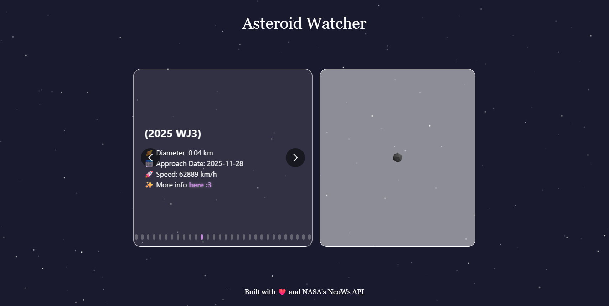

# Asteroid Watcher
A React app that visualizes asteroids approaching Earth in the near future using NASA’s NeoWs API.
Check it out here!: https://asteroid-watch-mu.vercel.app/

## Overview
Features:
- A carousel of asteroids approaching today and tomorrow
- Key details: name, diameter, speed, and more!
- Each asteroid shows up as a 3D mesh that takes the size, speed, and hazard into account.
- A starfield background with subtle animations ✨

## Built With
- React
- Tailwind CSS
- Vite
- Three.js
- NASA NeoWs API

## What I Learned
I took this project as a way to learn several things, such as:
- Three.js
- making API calls
- Tailwind CSS
- the parallax effect for the starfield